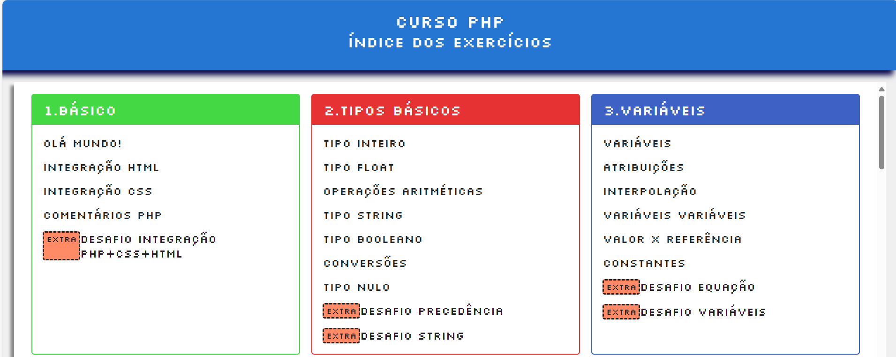
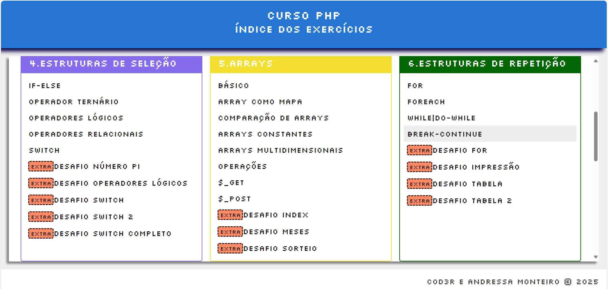
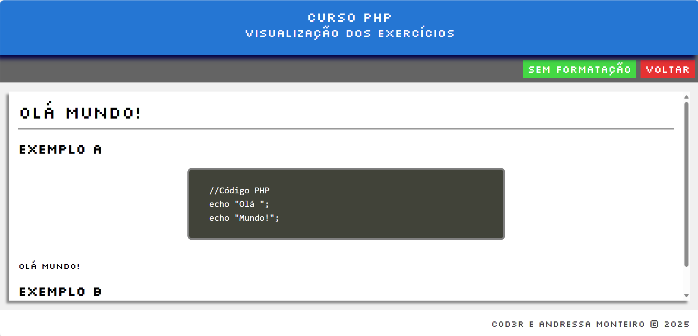

# 📘 Curso de PHP
Projeto do Curso de [PHP 7 Completo - Curso do Desenvolvedor Web + Projetos](https://www.udemy.com/course/php-7-completo/).

### 🚀 Conteúdo do Curso

- [x] Introdução PHP
- [x] Revisão HTML e CSS
- [x] Integrando PHP com HTML e CSS
- [x] Tipos Básicos
- [x] Variáveis
- [x] Estruturas de Seleção
- [x] Arrays
- [x] Estruturas de Repetição  
- [ ] Funções
- [ ] Programação Orientada a Objetos
- [ ] Inclusão de Arquivo
- [ ] Banco de Dados

## 🛠️ Tecnologias e Ferramentas Utilizadas
- **PHP**  
- **WampServer** (ambiente de desenvolvimento local)  
- **Google Chrome** (teste em `localhost`)  
- **Visual Studio Code** (IDE principal) 

## 🖼️ Interface da Aplicação

  
  
  

